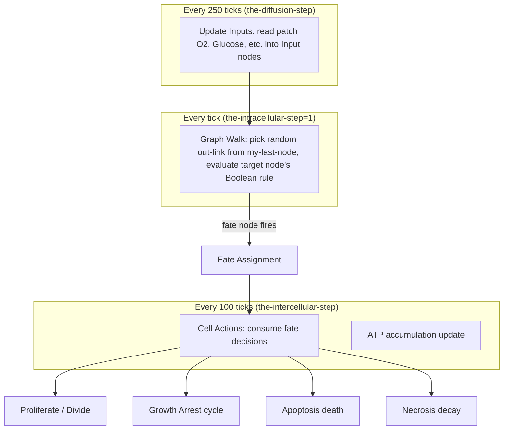
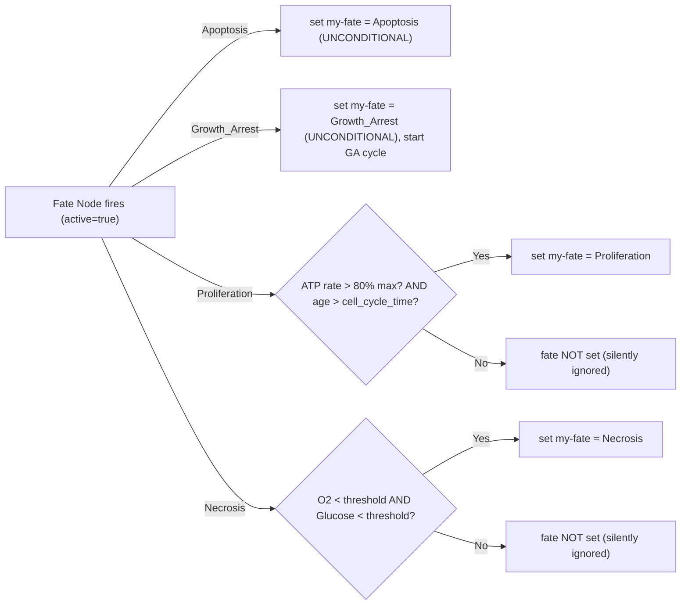
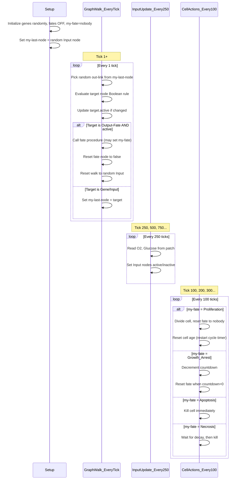

# NetLogo Phenotype Decision: Full Pipeline

This document traces, step by step, how `microC_Metabolic_Symbiosis.nlogo3d` decides a cell's phenotype and acts on it. Each section has pseudocode plus the exact NetLogo procedure and line numbers.

---

## Architecture Overview

The model has **three nested timing loops**, each running at a different frequency:

| Layer | Timer | Default | What runs |
|---|---|---|---|
| Intracellular | `the-intracellular-step` | **1 tick** | Gene network graph walk (1 random step per tick) |
| Diffusion | `the-diffusion-step` | **250 ticks** | Input node updates from patch concentrations |
| Intercellular | `the-intercellular-step` | **100 ticks** | Proliferation, Growth Arrest consumption, Necrosis decay |
| Apoptosis | `the-apoptosis-step` | = intercellular (batch) | Apoptosis/Necrosis death actions |



---

## Phase 1: Initialization (Setup)

When a Cell is created via `kind-initialisation "Cell"` (lines 318-339):

### Pseudocode

```
for each Gene node in cell:
    gene.active = random_choice(true, false)       # -RANDOMLY-ACTIVE-73

for each Input node in cell:
    input.active = false (0)                        # -INACTIVE-8

for each Output node in cell:
    output.active = false                           # -INACTIVE-1

for each Output-Fate node in cell:
    fate_node.active = false                        # -INACTIVE-5

cell.my_fate = nobody                               # no fate yet
cell.my_cell_age = ticks                            # CELL-AGE
cell.my_last_node = random(Input nodes)             # -LAST-NODE-12

# Schedule recurring behaviors:
schedule every(the-intracellular-step):  graph_walk_step()   # -RUN-MICRO-STEP-195
schedule every(the-diffusion-step):      update_inputs()      # -UPDATE-INPUTS-15
schedule every(the-intercellular-step):  cell_actions()       # -CELL-ACTIONS-76
```

### NetLogo code

**Gene init** -- lines 1952-1956:

```netlogo
to -RANDOMLY-ACTIVE-73
   set my-active one-of [ true false ]
end
```

**Fate node init** -- lines 2047-2051:

```netlogo
to -INACTIVE-5
   set my-active false
end
```

**Cell age init** -- lines 1008-1025:

```netlogo
to CELL-AGE
  set my-cell-age ticks
  set my-cell-ran1 random-float 1.0
  set my-cell-ran2 random-float 1.0
end
```

**Walk position init** -- lines 1068-1074:

```netlogo
to -LAST-NODE-12
   do-after ( 0.1 )
     task [ set my-last-node
         ifelse-value (one-of my-nodes with [kind = "Input"] = nobody)
           [one-of my-nodes with [kind = "Gene"]]
           [one-of my-nodes with [kind = "Input"]] ]
end
```

---

## Phase 2: Input Updates (Diffusion Layer)

Every `the-diffusion-step` (250) ticks, each Input node reads its substance concentration from the cell's patch and converts it to a Boolean.

### Pseudocode

```
# Runs every 250 ticks -- -UPDATE-INPUTS-15 -> -ACTIVE-FROM-PATCH-16
for each Input node:
    concentration = patch.substances[node.id]
    node.active = (concentration >= node.activation_threshold)
    
    # Special Hill-function logic for MCT1I and GLUT1I:
    if node.id == "MCT1I":
        node.active = (0.85 - 0.85/(1 + (conc/threshold)^1)) > cell.ran1
    if node.id == "GLUT1I":
        node.active = (0.85 - 0.85/(1 + (conc/threshold)^1)) > cell.ran2
```

### NetLogo code -- lines 1271-1328

---

## Phase 3: Gene Network Update (Graph Walk -- every tick)

This is the core intracellular logic. Every `the-intracellular-step` (1) tick, the cell takes ONE random step through its gene network graph.

### Guard Condition

Before walking, the cell checks whether it should still be updating:

```
# -RUN-MICRO-STEP-195, line 1611
if reversible_mode:
    guard = (my_fate != "Necrosis")     # keep updating unless Necrosis
else:
    guard = (my_fate == nobody)          # stop at ANY fate
```

### Pseudocode (one step)

```
# -DOWNSTREAM-CHANGE-590 + -INFLUENCE-LINK-END-WITH-LOGGING--36

current_node = cell.my_last_node
link = random_choice(current_node.out_links)    # pick ONE random outgoing link
target = link.end2                               # the downstream node

# 1. Evaluate Boolean rule
new_state = evaluate(target.rule)                # runresult my-rule

# 2. Update if changed (and not mutated)
if target.active != new_state AND target.id not in cell.mutations:
    target.active = new_state

# 3. Handle Output-Fate nodes
if target.kind == "Output-Fate":
    if target.active == true:
        # -- FATE FIRES: call fate-specific procedure --
        call fate_procedure(target.id)           # see Phase 4 below
    
    if target.active == false AND target.id == cell.my_fate:
        # -- FATE REVERTS: the current fate's node went OFF --
        cell.my_fate = nobody
    
    target.active = false                        # ALWAYS reset fate node (transient!)
    cell.my_last_node = random(Input nodes)      # reset walk position

# 4. Handle Output (non-fate) nodes
elif target.kind == "Output":
    cell.my_last_node = random(Input nodes)      # reset walk position

# 5. Handle Gene / Input nodes
elif target.kind in ("Gene", "Input"):
    cell.my_last_node = target                   # continue walk from here
```

### NetLogo code

**Scheduler** -- lines 1607-1614:

```netlogo
to -RUN-MICRO-STEP-195
   do-after (1)
     task [ do-every (the-intracellular-step)
       task [ if (ifelse-value(the-reversible?)[my-fate != "Necrosis"][my-fate = nobody])
                [ ask my-last-node [ -DOWNSTREAM-CHANGE-590 ] ] ] ]
end
```

**Step selector** -- lines 1601-1605:

```netlogo
to -DOWNSTREAM-CHANGE-590
   ask one-of my-out-links
       [ add-link-behaviours-after 0
           (list task [ -INFLUENCE-LINK-END-WITH-LOGGING--36 ]) ]
end
```

**Core node update + fate check** -- lines 1506-1599 (full code in the NetLogo file; key excerpts above in pseudocode)

### Critical Detail: Fate Node Reset

After ANY visit to a fate node, the node is **always reset to false** (line ~1590: `ask end2 [ set my-active false ]`). This means:

- Fate nodes are **transient signals**, not latches
- They can only fire during the instant they are visited
- The walk resets back to an Input node after each fate/output visit

---

## Phase 4: Fate Assignment (when fate nodes fire)

When a fate node evaluates to `true` during the graph walk, the cell calls a fate-specific procedure. **Not all fate assignments are unconditional** -- some are gated by metabolic or environmental conditions.



### Apoptosis -- UNCONDITIONAL

Lines 1363-1367:

```netlogo
to -FATE-APOPTOSIS-25
   set my-fate "Apoptosis"
end
```

### Growth Arrest -- UNCONDITIONAL (but starts a countdown)

Lines 1369-1385:

```netlogo
to -FATE-GROWTH-ARREST-96
   set my-fate "Growth_Arrest"
end

to -GROWTH-ARREST-CYCLE-171
   set my-growth-arrest-cycle the-growth-arrest-cycle   ; default = 3
end

to -LABEL-DECISION-2
   set my-network-decision? true
end
```

### Proliferation -- GATED (two conditions must pass)

Lines 1387-1417:

```netlogo
to -FATE-PROLIFERATION-102
  if (my-mutation-group = 1
      and my-cell-atp-rate > the-atp-threshold1 * the-cell-atp-rate-max
      and (ticks - my-cell-age) > the-cell-cycle-time) [
    set my-fate "Proliferation"
  ]
  if (my-mutation-group >= 2
      and my-cell-atp-rate > the-atp-threshold1 * the-cell-atp-rate-max
      and (ticks - my-cell-age) > the-cell-cycle-time) [
    set my-fate "Proliferation"
  ]
end
```

**Both conditions are required**: ATP production rate above 80% of maximum, AND enough ticks since birth/last division (default 1000).

### Necrosis -- GATED (environmental conditions)

Lines 1419-1452:

```netlogo
to -FATE-NECROSIS-20
  if (table:get substances-of-patch "Oxygen" < the-necrosis-threshold
      and table:get substances-of-patch "Glucose" < the-necrosis-threshold-g) [
    set my-nec-start ticks
    set my-fate "Necrosis"
  ]
end
```

### Fate Reversion (any fate)

If the fate node that matches the cell's current `my-fate` evaluates to `false` on a subsequent visit, the fate reverts:

```netlogo
; line 1587-1589
if (not [my-active] of end2) and ([my-id] of end2 = current-fate) [
    ask [my-cell] of end2 [set my-fate nobody]
]
```

**This means**: `my-fate` is NOT permanent. It is a real-time, overwriting variable that can be set, reverted, and overwritten by any fate node at any graph-walk step.

---

## Phase 5: Fate Consumption (Cell Actions -- every 100 ticks)

Fates are consumed (acted upon) by the intercellular layer. This is where cells actually divide or die. Scheduled by `-CELL-ACTIONS-76` (lines 1943-1950):

```netlogo
to -CELL-ACTIONS-76
   -PROLIFERATE-870        ; division logic
   -GROWTH-ARREST-10       ; temporary arrest + countdown
   -APOPTOSIS-NECROSIS-100 ; death
   J-DEATH                 ; necrosis decay (delayed death)
end
```

### 5a. Proliferation Consumption

**Runs every `the-intercellular-step` (100) ticks** -- lines 1765-1774:

```
# Pseudocode
if cell.my_fate == "Proliferation":
    count_proliferation_event()
    
    # RESET FATE (-RESET-FATE-145):
    if any_empty_neighbors():
        cell.my_fate = nobody          # consume the fate!
        cell.my_cell_age = ticks       # reset birth clock for next division
        cell.ran1, cell.ran2 = random() # new random values
    
    # QUIESCENCE CHECK (-TURN-QUIESCENCE-3):
    if no_empty_neighbors():
        cell.my_fate = "Growth_Arrest" # can't divide, become quiescent
        cell.my_growth_arrest_cycle = 3
    
    # ACTUAL DIVISION (-PROLIFERATE-869):
    if total_cells < max AND any_empty_neighbors():
        sprout new Cell on empty neighbor patch
        initialize new cell (copy mutations, gene network, etc.)
```

**KEY**: Proliferation is self-consuming. The cell divides, resets `my-fate` to `nobody`, and resets `my-cell-age`. It then needs another 1000+ ticks before Proliferation can fire again. This is why Proliferation is rarely the "final state" of a cell -- it gets consumed immediately.

### 5b. Growth Arrest Consumption

**Runs every `the-intercellular-step` (100) ticks** -- lines 1870-1879:

```
# Pseudocode
if cell.my_fate == "Growth_Arrest":
    cell.my_growth_arrest_cycle -= 1       # countdown
    if cell.my_growth_arrest_cycle == 0:
        cell.my_fate = nobody              # exit growth arrest
```

Growth Arrest lasts **3 intercellular steps = 300 ticks** by default, then the cell returns to quiescent (`my_fate = nobody`).

### 5c. Apoptosis Consumption

**Runs every `the-apoptosis-step` ticks** -- lines 1927-1941:

```
# Pseudocode
if cell.my_fate == "Apoptosis":
    count_apoptosis_event()
    kill_all_nodes()           # -DIE-NODES-289
    kill_cell()                # -DIE-2597: set dead = true
    # Cell is IMMEDIATELY removed from simulation
```

### 5d. Necrosis Consumption

Necrosis has TWO stages:

**Stage 1** (immediate, in `-APOPTOSIS-NECROSIS-100`): Count necrosis event. Cell stays alive but is marked.

**Stage 2** (delayed, in `J-DEATH`, every 100 ticks) -- lines 1779-1820:

```
# Pseudocode
if cell.my_fate == "Necrosis":
    time_since_necrosis = ticks - cell.my_nec_start
    rand = random_float(1.0)
    if time_since_necrosis > the-cell-decay-time * (0.4 * rand + 0.8):
        kill_all_nodes()
        kill_cell()
```

With `the-cell-decay-time = 99000`, necrotic cells persist for a long time (79,200-118,800 ticks) before being removed.

---

## Phase 6: Complete Timeline of One Cell's Life



---

## Summary: Why Proliferation Dominates in NetLogo

1. **Proliferation is gated but self-resetting**: When it fires, the cell divides, resets `my-fate = nobody`, and resets `my-cell-age`. After another 1000 ticks, it can proliferate again. One cell can proliferate many times.

2. **Apoptosis is terminal**: Once set, the cell dies at the next apoptosis-step check. Dead cells are removed. So Apoptosis "removes itself from the count" -- you don't see many apoptotic cells because they're dead.

3. **Growth Arrest is temporary**: It self-resolves after 3 intercellular steps (300 ticks), returning the cell to quiescent.

4. **Necrosis requires extreme conditions**: Both oxygen AND glucose must be below thresholds, which only happens in deep interior of large spheroids.

5. **Net effect**: At any snapshot, most living cells are either quiescent (between events) or have recently proliferated (because Proliferation was consumed). Dead cells are gone. This produces the population growth observed in NetLogo.

---

## Key Parameters (Default Values)

From the NetLogo GUI sliders and code:

- `the-intracellular-step`: **1** tick (gene network updates)
- `the-intercellular-step`: **100** ticks (cell actions)
- `the-diffusion-step`: **250** ticks (input updates)
- `the-cell-cycle-time`: **1000** ticks (minimum time between divisions)
- `the-atp-threshold1`: **0.8** (80% of max ATP rate required for proliferation)
- `the-growth-arrest-cycle`: **3** (intercellular steps before growth arrest ends = 300 ticks)
- `the-cell-decay-time`: **99000** ticks (necrosis decay time)
- `the-necrosis-threshold`: **0.011** (oxygen threshold)
- `the-necrosis-threshold-g`: **3.9** (glucose threshold)
- `the-reversible?`: **true** (default in experiments; allows fate changes except during Necrosis)
- `the-maximum-cell-count`: **4000** cells
